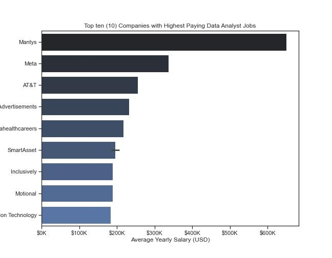
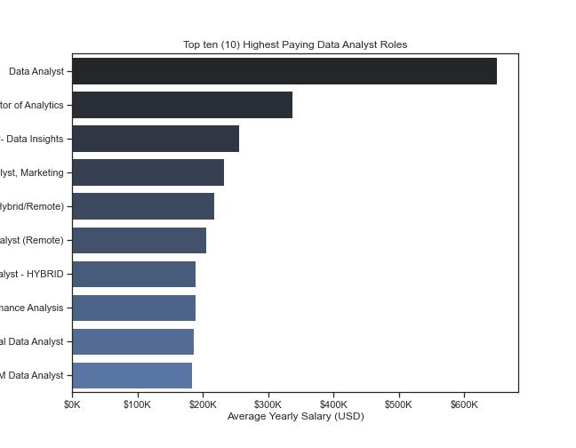
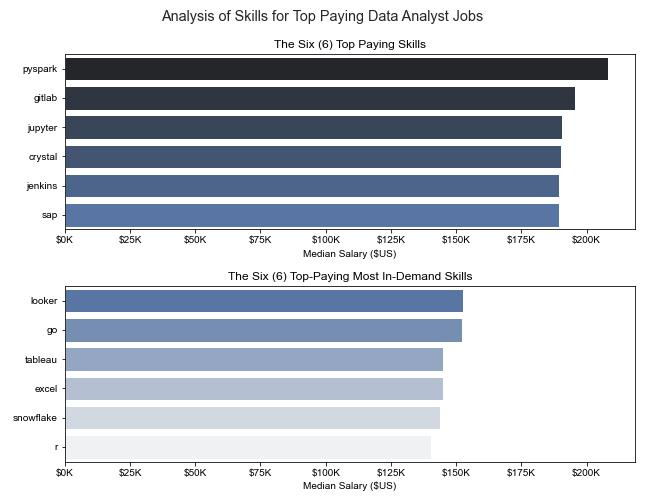
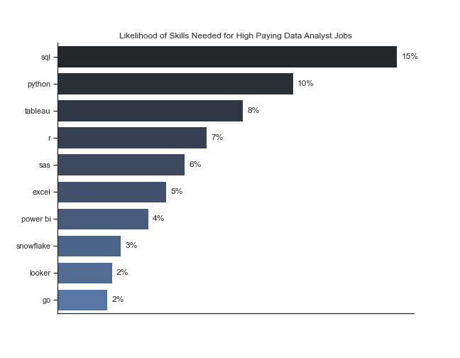
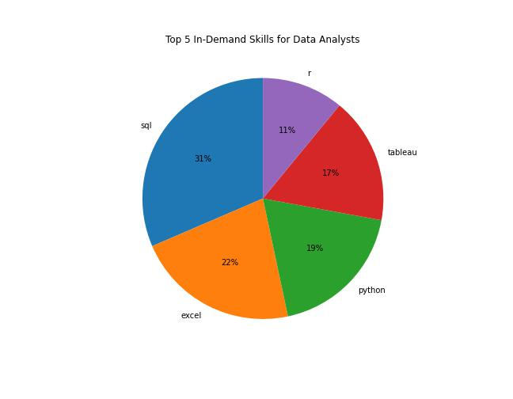
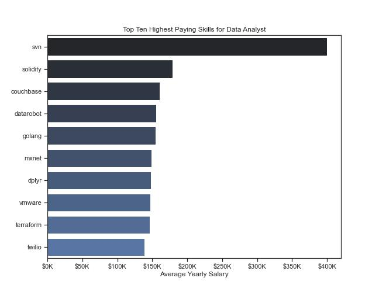
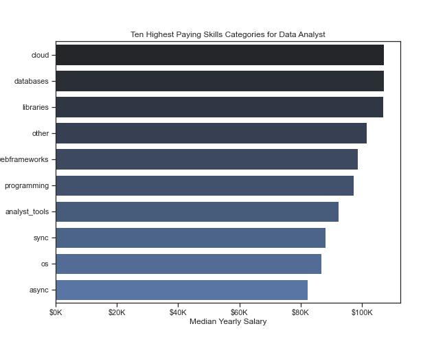

# Introduction
A look into the data job market by analyzing the postings of data job openings. Focusing on roles for Data Analyst, this project explores in-demand skills, top-paying jobs, and where high demand meets high salary in Data Analytics.

To see the SQL queries, check here: 
[project_sql folder](/project_sql/)


# Background
To understand the data job market better, it became imperative to analyze the data job postings for several positions from several locations (cities and countries). 

This analysis was predicated on the desire for top-paying jobs, knowledge of the skills that are in high demand, and the most optimal skills for a Data Analyst position. Such insights will guide the decisions of job seekers or even professionals in the Data-Inclined field.

Five questions will be answered in this project. They include;
1.	What are the top-paying Data Analyst jobs?
2.	What skills are needed for the top-paying Data Analyst jobs?
3.	What are the most in-demand skills for a Data Analyst?
4.	What are the top skills based on salary for a Data Analyst?
5.	What are the most optimal skills (high-demand, high-paying) for a Data Analyst role?

# Tools I Used
To achieve the set objective of analyzing data job postings to answer some preset questions, the capabilities of several tools and languages were utilized. These included:

**SQL:** This was used to communicate with a relational database that contains job postings, the names of companies that posted the jobs, and the skills mentioned in each posting. This communication was achieved through queries designed to retrieve datasets from a database in line with the questions to be answered. 

**PostgreSQL:** The particular Relational Database Management System used in this project. Used to execute Joins, Subqueries, and Common Table Expressions that are applied to derive the data needed to answer the questions.

**Git and GitHub:** The Version Control System (Git) and the hosting platform (GitHub) were used to prepare the files for display and sharing with the public, track changes made to the files, and publish the necessary files to the public.

**VS Code:** This was the Code Editor used to write the SQL queries, in the Postgres syntax, to communicate with the database. It was also used to upload files (and changes to files) to GitHub.

# The Analysis
This section presents the investigation of the job market data through an analysis of the data job postings. 

The snippet of the queries written and executed, with the results obtained, is included for each question answered. 

A brief description of the methodology applied in answering each question is also presented.

### Q1: What are the top-paying Data Analyst jobs?
Determining the jobs in the Data Analyst role that have the highest yearly salary. 

Answering this question required filtering the data for Data Analyst roles, which involved only REMOTE WORK. Information on the job title, company name, and schedule type (e.g, full-time, part-time, etc.) was also provided.

Results from this analysis presents the various employment opportunities for a Data Analyst, and the roles a Data Analyst can play in a company. This can help in targeting specific companies for oppurtunities.

SQL code is shown below

```sql
SELECT
    job_id, 
    job_title, 
    job_location,
    job_schedule_type, 
    salary_year_avg,
    job_posted_date,
    name AS company_name
FROM
    job_postings_fact
LEFT JOIN
    company_dim
ON
    job_postings_fact.company_id = company_dim.company_id
WHERE
    job_location = 'Anywhere' AND
    job_title_short = 'Data Analyst' AND
    salary_year_avg IS NOT NULL 
ORDER BY
    salary_year_avg DESC
LIMIT 15 ;
```
#### INSIGHTS
The role of a Data Analyst takes several job titles, which vary from one company to another.

Salaries Range Widely from $165,000 to $650,000.

Most Salaries Cluster Between $165k and $230k. This defines the optimal salary range for Intermediate to Senior Data Analyst roles.

Senior Roles Pay Significantly More. Director and Principal titles (e.g., "Director of Analytics", "Principal Data Analyst") pay $180k–$336k. Demonstrates a clear progression in salary with seniority.

Different companies pay different salaries for the role. This may be based on cader and experience.



*Plot of Average Yearly Salary for Work From Home Location Data Analyst Role from Different Companies*



*Plot of Average Yearly Salary for Work From Home Location for different Data Analyst Roles*


### Q2: What are the skills for the top-paying Data Analyst jobs?

Presents the skills that are required for those jobs that pay the most in a Data Analyst role, i.e. the skills of the top paying Data Analyst jobs.

To answer this question, the dataset was filtered based on yearly salary values that were NOT NULL, while returning the information for the job identification, title, company name, and salary sorted in descending order. The final results were then sorted in decreasing order of average salary values.  

A JOIN operation was used to extract the skills, company names and other needed data(from their respective dimension tables) that matched the high-paying jobs.

The result of this analysis will provide invaluable information on the skills required to aspire for any top-paying Data Analyst role in a particular organization. Any data professional seeking a high-paying role in any company will be aware of the skills needed for such a position.

SQL code is shown below
```sql
WITH top_paying_jobs AS(

        SELECT
            job_id, 
            job_title, 
            salary_year_avg,
            name AS company_name
        FROM
            job_postings_fact
        LEFT JOIN
            company_dim
        ON
            job_postings_fact.company_id = company_dim.company_id
        WHERE
            job_title_short = 'Data Analyst' AND
            salary_year_avg IS NOT NULL 
        ORDER BY
            salary_year_avg DESC
        LIMIT 50000 
)
SELECT 
    top_paying_jobs.*,
    skills
FROM
    top_paying_jobs
INNER JOIN
    skills_job_dim ON top_paying_jobs.job_id = skills_job_dim.job_id
INNER JOIN
    skills_dim ON skills_job_dim.skill_id = skills_dim.skill_id
ORDER BY
    salary_year_avg DESC ;
```

An alternative SQL code for this is shown below,
```SQL
SELECT
        jpf.job_id,
        jpf.job_title,
        jpf.salary_year_avg AS average_yearly_salary,
        cd.name AS company_name,
        skd.skills AS job_skills
FROM
    job_postings_fact AS jpf
INNER JOIN
    company_dim AS cd  ON jpf.company_id = cd.company_id
INNER JOIN
    skills_job_dim AS skjd ON skjd.job_id = jpf.job_id
INNER JOIN
    skills_dim AS skd ON skjd.skill_id = skd.skill_id
WHERE
    jpf.job_title_short = 'Data Analyst' AND
    jpf.salary_year_avg IS NOT NULL 
ORDER BY
    jpf.salary_year_avg DESC
LIMIT
    50000 ;
```
#### INSIGHTS
Most in-demand skills for the High-Paying Data Analyst role are not NECESSARILY the same as the Highest-Paying skills.

For the top-paying Data Analyst jobs, SQL is the Most In-Demand skill, followed by Python, Tableau, R, SaS, Excel, and Power BI. Thus, to land a top-paying Data Analyst role, SQL is a MUST-HAVE skill.

Specialized skills in Web Applications, Cloud applications, and DevOps will significantly contribute to achieving a much higher pay in a Data Analyst role. Skills in these areas make up most of the Highest-Paying skills set.

For the most in-demand skills of the top paying job skills, VISUALIZATION and ANALYTICAL skills contributed more to a high-paying Data Analyst role. The Database Manipulation skill has a lower influence (in comparison) on the pay of the Data Analyst role.

 


*Plot of Top Paying Skills and Top Paying Most In-Demand Skills for High Paying Data Analyst Jobs*



*Plot of Likelihood of Most In-Demand Skills for High Paying Data Analyst Jobs*

### Q3: What are the Most In-Demand skills for Data Analyst role?

This involved presenting the most frequently mentioned skills in job postings for any role of interest (in our case, the Data Analyst role). A count of the skills, in postings for a Data Analyst job, was obtained with the final result sorted in descending order (of the count values).

A Join operation was employed to combine the necessary data from multiple tables (jobs_posted_fact, skills_dim, and skills_job_dim), and the count of the skills for all the Data Analyst job postings (that had yearly salary values) was obtained. The top six (6) skills were extracted and presented in a pie chart.

This analysis will provide feedback on the most in-demand skills for a Data Analyst role. That way, the knowledge of the skills to develop for the role of interest will be readily available, thus saving time and effort.  

SQL code is shown below
```sql

SELECT
    skills,
    skill_count

FROM(
        SELECT
            skill_id,
            COUNT(skills_job_dim.skill_id) AS skill_count
        FROM
            job_postings_fact
        INNER JOIN
            skills_job_dim
        ON
            job_postings_fact.job_id = skills_job_dim.job_id
        WHERE
            job_postings_fact.job_title_short = 'Data Analyst' AND
            job_postings_fact.salary_year_avg IS NOT NULL
        GROUP BY
            skill_id
        ORDER BY
            skill_count DESC
    ) AS skill_demand

INNER JOIN
    skills_dim
ON
    skill_demand.skill_id = skills_dim.skill_id
ORDER BY
        skill_count DESC ;

```
Alternative SQL query is

```sql

SELECT 
    skills_dim.skills,
    COUNT(*) AS demand_count
    
FROM
    job_postings_fact
INNER JOIN
    skills_job_dim ON job_postings_fact.job_id = skills_job_dim.job_id
INNER JOIN
    skills_dim ON skills_job_dim.skill_id = skillS_dim.skill_id
WHERE
    job_title_short = 'Data Analyst' AND
    job_postings_fact.salary_year_avg IS NOT NULL
GROUP BY
    skills_dim.skills
ORDER BY
    demand_count DESC ;

```

#### INSIGHTS

SQL is the most in-demand skill for Data Analysts. The analysis of the TOP 5 skills showed SQL ranked first with 31%, followed by Excel (22%), Python (19%), Tableau (17%), and R (11%).

Analytical skills made up four (4) of the top five (5) most in-demand skills for Data Analysts.

The fact that SQL is the most in-demand skill indicates that many companies and organizations maintain a database. Therefore, the ability to query the database(s) to retrieve data for analysis is important.



*Assessment of the top 5 In-Demand Data Analyst skills*

### Q4: What are the Top skills for a Job role, based on salary?

This question aimed to determine the most valuable skills for a particular job role based on their influence on the average annual salary rather than how many times they appeared (or are mentioned) in a job posting.

A Join operation was used to combine data from multiple tables (jobs_posted_fact, skills_dim, and skills_job_dim), and the average yearly salary of all skills for the DATA ANALYST job role was calculated. The values were then ordered in descending order of salary values.

This analysis will present invaluable information on the MOST FINANCIALLY VALUABLE AND REWARDING skill to acquire. It will also show the impact skills have on the average annual salary value for a data role of interest.

SQL code is shown below
```sql

SELECT 
    skills_dim.skills,
    ROUND(AVG(salary_year_avg), 0) AS average_salary
    
FROM
    job_postings_fact
INNER JOIN
    skills_job_dim ON job_postings_fact.job_id = skills_job_dim.job_id
INNER JOIN
    skills_dim ON skills_job_dim.skill_id = skillS_dim.skill_id
WHERE
    job_title_short = 'Data Analyst' AND
    salary_year_avg IS NOT NULL AND
    job_work_from_home = True
GROUP BY
    skills_dim.skills
ORDER BY
    average_salary DESC
LIMIT 25 ;

```


Alternatively, the SQL code below presents the average salary and median salary values of the skills in one result table

```sql

SELECT
        skdim.skills AS skill_name,
        skdim.type AS skill_type,
        PERCENTILE_CONT(0.5) WITHIN GROUP(
            ORDER BY Salary_Data_Jobs.salary_year_avg DESC
        )::INTEGER AS Median_Salary,
        ROUND(AVG(Salary_Data_Jobs.salary_year_avg),0) AS average_yearly_salary
FROM(
        SELECT
            job_id, 
            salary_year_avg
        FROM
            job_postings_fact AS jpf
        WHERE
            salary_year_avg IS NOT NULL AND
            job_title_short = 'Data Analyst'
        
) AS Salary_Data_Jobs
INNER JOIN 
    skills_job_dim AS sjdim ON sjdim.job_id = Salary_Data_Jobs.job_id
INNER JOIN
    skills_dim skdim ON skdim.skill_id = sjdim.skill_id
GROUP BY
    skdim.skills,
    skdim.type
ORDER BY
    average_yearly_salary DESC,
    Median_Salary DESC

```

#### INSIGHTS

Cloud, Databases, and Libraries are the top 3 SKILLS categories with the highest median salaries for a data analyst role.

Specialized skills in Version Control Tools (such as Apache Subversion (SVN)) can attract a high average salary for a data analyst. In all, the top 10 skills for Data Analysts - based on salary - are specialized

Programming, Libraries, and Analyst Tools are the top 3 categories of the most in-demand, highest-paying skills for a data analyst role. Skills in these categories are frequently mentioned in job postings.



*Top ten (10) skills for a Data Analyst job role based on Average Yearly Salary*




*Top Skills Categories, for Data Analysts, with Highest Median Salary*


### Q5: What are the MOST OPTIMAL skills for a Job role?

This scenario focused on identifying high-paying, most in-demand skills for a Data Analyst role. It analyzed the skills for a Data Analyst role based on salary and frequency of its mention in job postings.

    The result of this analysis depends on which parameter 
    is considered most important: the salary or the 
    frequency of mention. A different result was obtained 
    for whichever parameter was considered first. FOR THIS 
    PROJECT, THE SALARY WAS CONSIDERED BEFORE THE COUNT.
		
A JOIN operation was also applied in this case to    
retrieve the necessary data from multiple tables. The 
average of the salary and the frequency of the skills 
were evaluated in the same query, and the result was 
sorted by salary and the frequency of skills.

This analysis presented results that showed at a glance how important skills were in terms of the average-salary they could attract, or how often they were mentioned in job postings. This way, anyone aspiring for the role of a Data Analyst can gauge the OPTIMALITY of a skill of interest.


SQL code is shown below. This uses two Common Table Expressions (CTEs). . . . 
```sql

    WITH skills_demand AS(
        SELECT 
            skills_dim.skill_id AS skill_id,
            skills_dim.skills AS skills,
            COUNT(*) AS demand_count
            
        FROM
            job_postings_fact
        INNER JOIN
            skills_job_dim ON job_postings_fact.job_id =        skills_job_dim.job_id
        INNER JOIN
            skills_dim ON skills_job_dim.skill_id = skillS_dim.skill_id
        WHERE
            job_title_short = 'Data Analyst' AND
            salary_year_avg IS NOT NULL
        GROUP BY
            skills_dim.skills,
            skills_dim.skill_id

),  average_salary AS(
        SELECT 
            skills_dim.skill_id AS skill_id,
            skills_dim.skills AS skills,
            ROUND(AVG(salary_year_avg), 0) AS avg_salary
            
        FROM
            job_postings_fact
        INNER JOIN
            skills_job_dim ON job_postings_fact.job_id = skills_job_dim.job_id
        INNER JOIN
            skills_dim ON skills_job_dim.skill_id = skillS_dim.skill_id
        WHERE
            job_title_short = 'Data Analyst' AND
            salary_year_avg IS NOT NULL
        GROUP BY
            skills_dim.skills,
            skills_dim.skill_id
)

SELECT
    skills_demand.skill_id,
    skills_demand.skills,
    demand_count,
    avg_salary
FROM
    skills_demand
INNER JOIN
    average_salary ON skills_demand.skill_id = average_salary.skill_id
ORDER BY
    avg_salary DESC,
    demand_count DESC
    
LIMIT 25 ;

```

Alternatively, the SQL code below presents the same result

```sql

    SELECT
        skd.skills AS skill_name,
        COUNT(skd.skill_id) AS skills_count,
        ROUND(AVG(jpf.salary_year_avg),2) AS avg_salary        
FROM
    job_postings_fact AS jpf
    
INNER JOIN
    skills_job_dim AS skjd ON jpf.job_id = skjd.job_id
INNER JOIN
    skills_dim AS skd ON skjd.skill_id = skd.skill_id
WHERE
    salary_year_avg IS NOT NULL AND
    job_title_short = 'Data Analyst' 
GROUP BY
    skd.skills

ORDER BY
   avg_salary DESC,
   skills_count DESC
LIMIT
    25 ;

```

#### INSIGHTS

From an assessment of the first twenty-five (25) skills, those with the highest average yearly salary actually have the lowest demand. This means that the skills THAT ARE NOT FREQUENTLY MENTIONED IN JOB POSTINGS ATTRACT A HIGH AVERAGE SALARY.

The top-paying skills are usually specialized ones. Cloud computing and Libraries development can earn you big bucks as a Data Analyst.


## What I Learned

SQL is the Most In-Demand skill for Data Analysts. This is because Businesses maintain a database where the data to be analyzed is stored. Knowing how to retrieve this data, by writing queries, is important.

As a Data Analyst, more money could be earned by climbing the career path from Junior to Senior or Managerial levels.

Acquiring knowledge and skills in specialized areas like Cloud Computing, Developing Libraries for specialized areas of analysis, and Databases can attract high average salaries for a Data Analyst role.

The most in-demand skills for a Data Analyst role are not NECESSARILY the most highest-paying ones.

## Conclusions

As a data enthusiast or someone interested in data analytics, data science, or data engineering, it is advisable to analyze job postings in those areas to derive a good understanding of the skills required and the salary involved.

Database Querying skills, such as SQL, are highly sought after in data analysis.

Cloud computing skills should be considered as well. They can contribute to earning a higher salary.

# Looking Forward

Look for the same dataset from other sources, analyze them, and compare the results. From the results, discover if they agree with those reported here or if they don’t.

